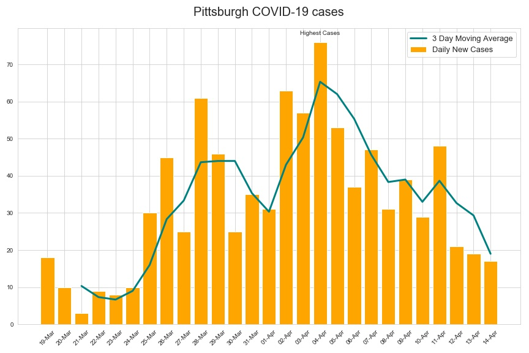

As cities and countries around the world are battling the COVID-19 pandemic, lets take a look at Pittsburgh's fight and some preliminary trends arising out of the mitigation measures taken. 

## Timeline of measures taken by government and local bodies
Allegheny county, which comprises of Pittsburgh and surrounding suburbs, was issued a stay-at-home order by the Pennsylvania State Governor Tom Wolf on March 23,2020. This was one of the earliest orders issued nationwide, with only [9 states across the country](https://www.nytimes.com/interactive/2020/us/coronavirus-stay-at-home-order.html) being put under the same restrictions by then. As we will see later in this article, closing the county early (about 50 cases as of Mar 23) seems to have had an effect in dampening down the spread. 

In addition to PA's order, University of Pittsburgh Medical Center (UPMC) [announced on March 14th](https://www.post-gazette.com/news/health/2020/03/14/covid-19-upmc-testing-coronavirus/stories/202003140044) that they were ready to begin testing patients for COVID-19 using an in-house test and were [opening up mutiple collection centres](https://inside.upmc.com/upmc-expects-to-launch-regional-testing-capabilities-next-week-widespread-covid-19-transmission-not-yet-detected/). This had set a good stage for the mitigation efforts in the uphill battle against COVID-19. 

All data used in this analysis is compiled from the daily text and email alerts provided by Allegheny County. 

## Is Pittsburgh flattening the curve ? 

Looking at the data, the short answer seems to be yes. After seeing an early spurt of cases, we are seeing the cumulative case graph trending towards a flattening on the log scale 

  

When it comes to daily cases, the <b>peak in daily new cases</b> seems to have happened on <b>Apr 4th</b>, roughly 2 weeks after the imposition of the stay-at-home order. This seems to be in line with expectations as the disease seems to be taking upto 2 weeks for symptoms to show up. After Apr 4, the trend of new cases seems to be on the decline as we see the 3 day moving average decreasing. 

  

## Hospitalizations and fatalities

At the start of the spread, the rate of growth in daily cases and hospitalizations was high and above 20%. In the last two weeks, that rate has steadily dropped and is hovering at about 5% daily growth. As of Apr 12th, the total hospitalizations (past or present) were 130 vs the cumulative confirmed case number being 857 resulting in about 15% hospitalization rate. 

  

Unfortunately, the number of deaths have also picked up in the last week rising to 19 as of Apr 12th. This has been the result of patients from some of the early hospitalized cases failing to recover. 

  

## Conclusion

Although unfortunately we might see more deaths due to the hospitalizations in last two weeks, the data in general seems to show a favorable trend in slowdown in cases and the much hyped "flattening of the curve" seems to be under way. UPMC has also announced good progress in a coronavirus vaccine, albeit approval and production of that being long way off. 

These are good signs, but it does not mean that Pittsburgh is out of the woods as noted by Dr.Mark Roberts from University of Pittsburgh in his [interview with WESA](https://www.wesa.fm/post/spread-covid-19-allegheny-county-slowing-its-too-soon-go-back-normal#stream/0). Following the guidelines laid out by local and state governments is going to be the key in not just flattening the curve, but crushing it altogether. 

